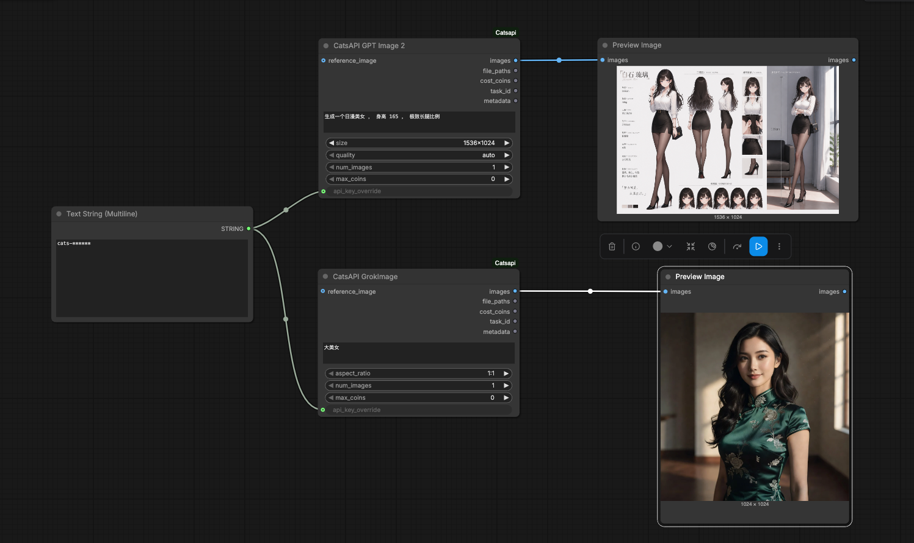

# ComfyUI CatsAPI

中文 | [English](README_en.md)

适用于 [CatsAPI / 猫影工坊](https://catsapi.com) 的 ComfyUI 自定义节点。

当前版本采用 **一个模型一个公开节点** 的设计，所以每个节点只显示该模型真实支持的参数，避免把 `size`、`resolution`、`quality` 等不同模型参数混在一起。底层共享同一套 API 鉴权、任务提交、轮询、结果下载和图片 tensor 转换逻辑。

## 示例

图片节点会返回 ComfyUI 的 `IMAGE` tensor，可以直接连接到 `Preview Image`。



上图示例中：

- `CatsAPI GPT Image 2` 使用 `size` / `quality`。
- `CatsAPI GrokImage` 使用 `aspect_ratio`。
- 两个节点可以共用一个 `Text String` 文本提示词节点。
- `api_key_override` 是可选输入，本地使用时通常留空。

## 节点列表

当前共 8 个图片节点、4 个视频节点；原有节点 key 和输出格式保持不变。

### 图片节点

| 节点 | 输入 |
|---|---|
| `CatsAPI GPT Image 2` | `prompt`、`size`、`quality`、`num_images`、`max_coins`、可选 `reference_image`、可选 `api_key_override` |
| `CatsAPI Nano Banana 2` | `prompt`、`resolution`、`aspect_ratio`、`num_images`、`max_coins`、可选 `reference_image`、可选 `api_key_override`、可选 `enable_web_search` |
| `CatsAPI Nano Banana Pro` | `prompt`、`resolution`、`aspect_ratio`、`num_images`、`max_coins`、可选 `reference_image`、可选 `api_key_override`、可选 `enable_web_search` |
| `CatsAPI FLUX.2 Pro` | `prompt`、`aspect_ratio`、`max_coins`、可选 `reference_image`、可选 `api_key_override` |
| `CatsAPI GrokImage` | `prompt`、`aspect_ratio`、`num_images`、`max_coins`、可选 `reference_image`、可选 `api_key_override` |
| `CatsAPI Seedream 5 Lite` | `prompt`、`image_size`、`num_images`、`max_coins`、可选 `reference_image`、可选 `seed`、可选 `api_key_override` |
| `CatsAPI Seedream 5 Pro` | `prompt`、`image_size`、`num_images`、`max_coins`、可选 `reference_image`、可选 `seed`、可选 `api_key_override` |
| `CatsAPI Grok Imagine Image 2` | `prompt`、`aspect_ratio`、`num_images`、`max_coins`、可选 `reference_image`、可选 `api_key_override` |

图片节点输出：

- `images`：ComfyUI `IMAGE` tensor
- `file_paths`：本地下载文件路径 JSON 列表
- `cost_coins`：本次消耗猫币
- `task_id`
- `metadata`：JSON 元信息

### 视频节点

| 节点 | 输入 |
|---|---|
| `CatsAPI Seedance 2.0` | `prompt`、`resolution`、`duration`、`aspect_ratio`、`max_coins`、可选 `start_image`、可选 `end_image`、可选 `reference_images`、可选 `api_key_override` |
| `CatsAPI GrokImageVideo` | `prompt`、`resolution`、`duration`、`aspect_ratio`、`max_coins`、可选 `start_image`、可选 `api_key_override` |
| `CatsAPI Seedance 2.0 Mini` | `prompt`、`resolution`、`duration`、`aspect_ratio`、`max_coins`、可选 `start_image`、可选 `end_image`、可选 `reference_images`、可选 `api_key_override` |
| `CatsAPI Gemini Omni Flash` | `prompt`、`duration`、`aspect_ratio`、`max_coins`、可选 `start_image`、可选 `api_key_override` |

视频节点会把生成的 `.mp4` 保存到 ComfyUI 输出目录的 `catsapi/` 子目录，并返回：

- `video_path`
- `cost_coins`
- `task_id`
- `metadata`

## 当前参数与兼容性

- GPT Image 2 提供 20 档尺寸，最多 16 张参考图；Nano Banana 2 最多 14 张，Nano Banana Pro 最多 4 张，FLUX.2 Pro 最多 3 张，GrokImage 最多 1 张。参考图 batch 超限会报错，不会静默截断。
- Nano Banana 2 / Pro 新增可选 `enable_web_search`，默认开启；旧工作流不连接该输入也能运行。两个模型默认分辨率均为 `1K`。
- Seedream 5 Lite / Pro 使用 `image_size`（API 字段 `imageSize`），默认 `square`，可选 4:3 / 16:9 横竖画幅，最多 4 张参考图。`seed=-1` 表示不传 seed，非负值会传给模型；节点未提供独立分辨率或质量参数。
- Grok Imagine Image 2 是独立新节点，支持 1–4 张输出、单张参考图，默认比例 `1:1`。
- Seedance 2.0 / Mini 默认 `480p` / 8 秒，固定 `inputMode=reference`。2.0 使用 `mode=fast`；Mini 不发送 `mode`。Grok 视频默认 `720p` / 8 秒。已有工作流显式保存的合法参数继续有效。
- 两个 Seedance 保留 `start_image`、`end_image`、`reference_images` 输入口，并按「起始图 → 参考图 → 结束图」合并提交；它们是参考素材，不保证严格首尾帧控制。
- 两个 Seedance 所有图片素材合计最多 4 张。主站 schema 虽写 9 张，worker 实际只保留 4 张，节点因此按 4 张总上限保护。当前节点不提供视频/音频参考输入。
- Gemini Omni Flash 支持 5–10 秒、16:9 / 9:16，默认 5 秒 / 16:9，可选单张起始图；不提供也不发送 `resolution` / `mode`。

## API Key 配置

支持两种配置方式。

### 方式一：本地 / 私有 ComfyUI 使用全局 Key

适合自己的电脑或私有 ComfyUI 服务器。

启动 ComfyUI 前设置环境变量：

```bash
export CATSAPI_API_KEY=cats-your-key
python main.py
```

如果 ComfyUI 没有继承 shell 环境变量，节点还会静态读取：

- 本自定义节点目录下的 `.env`
- ComfyUI 启动目录下的 `.env`
- `~/.catsapi.env`
- `~/.zshrc`
- `~/.bashrc`
- `~/.profile`
- `~/.bash_profile`

配置文件支持下面两种写法：

```bash
CATSAPI_API_KEY=cats-your-key
export CATSAPI_API_KEY="cats-your-key"
```

可选自建后端：

```bash
export CATSAPI_BASE=https://catsapi.com
```

### 方式二：RunningHub 等公共平台使用运行时覆盖

适合 RunningHub 这类用户无法控制服务器环境变量的公共 / 托管 ComfyUI 平台。

每个节点都有可选输入 `api_key_override`：

- 本地或私有 ComfyUI 使用时留空即可。
- 只有平台无法通过环境变量提供密钥时才填写。
- 该值只用于当前节点执行。
- 该值不会写入 `metadata`。
- 包含 `...` 或 `…` 的截断 Key 会在发请求前被拒绝。

注意：ComfyUI workflow JSON 可能保存 widget 值。不要发布或分享填了 `api_key_override` 的工作流。

## 花费保护

每次提交前都会预估费用并检查余额；预览异常时拒绝提交。`max_coins=0` 表示不设置花费上限，正数会阻止超过上限的任务。这是提交前检查，不是服务端原子锁价。

## 结果处理

- 图片结果会先下载到本地，再转换为 ComfyUI `IMAGE` tensor。
- 视频结果会下载到本地，并以 `video_path` 返回。
- 不把 CatsAPI 内部结果 URL 作为用户可见输出。
- 下载器使用浏览器类 headers，并带 `curl` fallback，尽量避开 CDN 机器人检测导致的下载失败。

## 安装

克隆到 ComfyUI 的 `custom_nodes` 目录：

```bash
cd ComfyUI/custom_nodes
git clone https://github.com/maodeyu180/ComfyUI_Catsapi.git
```

安装或更新后重启 ComfyUI。

## 离线验证

在项目 Python 环境中运行 `python -m unittest discover -s tests -v`。测试使用标准库和模拟媒体 / API，不需要安装完整 ComfyUI，不调用付费接口；不能替代真实 ComfyUI 的 UI 与 tensor 集成验证。

## 关联项目

- [CatsAPI 主站](https://catsapi.com)
- [CatsAPI Agent Skill](https://github.com/maodeyu180/CatsAPI-Agent-Skill)
